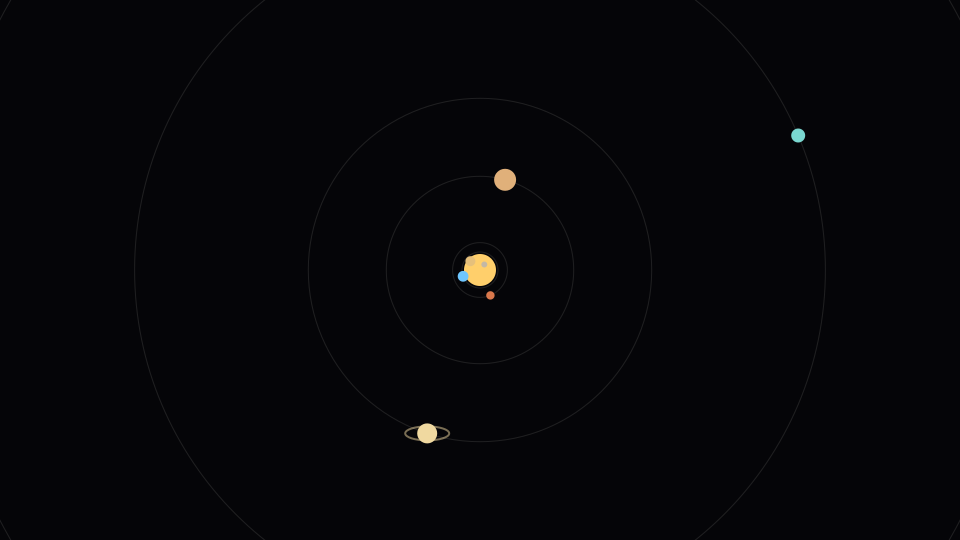

# Space Neighborhood / Vizinhança Espacial

A solar system playground for curious kids. Click the Sun, a planet, the Moon, or the asteroid belt to learn about it.

Um Sistema Solar para crianças curiosas. Clique no Sol, num planeta, na Lua ou no cinturão de asteroides para aprender.

Distances are real (AU). Planet sizes are bigger than real life — otherwise Earth is a pixel and nobody can click it.

As distâncias são reais (UA). Os planetas estão maiores do que na vida real — senão a Terra vira um pixel e ninguém consegue clicar.



English and Brazilian Portuguese: use **EN** / **PT** in the corner. The site follows your browser language the first time.

Inglês e português do Brasil: use **EN** / **PT** no canto. Na primeira visita, o site segue o idioma do navegador.

## Play / Jogar

Open [`index.html`](index.html) on **GitHub Pages**, or from this folder:

Abra o [`index.html`](index.html) no **GitHub Pages**, ou nesta pasta:

```bash
python3 -m http.server
```

Click anything you see. The card on the left tells you what it is, a fun fact, and whether people could live there.

Clique no que aparecer. O cartão à esquerda diz o que é, conta um fato legal e se daria para morar lá.

| Input | Action / Ação |
| --- | --- |
| Click a world | Learn about it / Aprender sobre ele |
| Click empty space | Overview / Visão geral |
| Drag | Pan / Arrastar o céu |
| Scroll | Zoom |
| Space | Pause / Pausar |
| `[` `]` | Speed / Velocidade |
| `1` `2` `3` `4` | Moon / nearby / planets / far out |
| `m` | Menu |
| `r` | Reset |
| `esc` | Close menu |

**Learn / Aprender** flies a ship to the Moon, lines up eclipses, and shows the nights planets are easiest to see from Earth.

Physics is leapfrog n-body in AU / years / solar masses (`G = 4π²`). No build, no dependencies, no backend. MIT.
